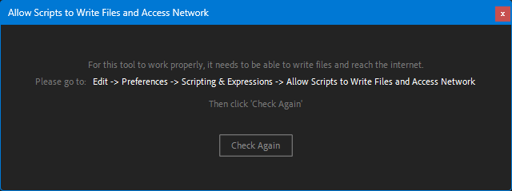

# Validate Access to Files and Network in After-Effects

A quick way to validate and / or condition access to files and network in After-Effects.
For example, if your entire script depends on a licensing system / a local options file, you can use this to validate access to the file before proceeding. ***Note that newer versions of After-Effects automatically show a user friendly dialog, consider whether you actually need to implement this or not*** 

---




Example of the palette shown to the user when access is not granted.

The path to where the preference option is located changes depending on the OS.

- MacOS - `After Effects > Preferences > Scripting & Expressions`

- Windows - `Edit > Preferences > Scripting & Expressions`


<br/>

# Installation
1. Clone this repository into your project folder.
2. Import `$FSAccessValidator` into your project using `#include ./FSAccess/$FSAccessValidator.jsx` and initialize it (See examples below)

<br/>

# Usage

```js
// index.jsx

(function(scriptUIPanelToken) {
   #include './FSAccess/FSAccess.jsx';
    var $accessValidator = new $FSAccessValidator();


    function main() {
        // main script code goes here, anything that depends on the access validation

    };

    /* 🚀🚀🚀🚀🚀🚀 */
    $accessValidator.conditionWithPalette(main, {
        toolName: 'Your Tool Name'
    })

})(this);


```

We import the `$FSAccessValidator` class and initialize a new instance of it. At the end of the script we call `conditionWithPalette` and pass it the main function of our script. This function will automatically be called if access is already granted, or if the user grants access after the palette is shown.

<br/>

# API
## $FSAccessValidator
### conditionWithPalette(callback, options)
- `callback` - The main function of your script, or whatever function you want to run after the access validation is complete.
- `options` - An object that lets you customize the palette shown to the user.
  - - `toolName` - The name of your tool (Default: `undefined`)
  - - `title` - The title of the palette window (Default: `Allow Scripts to Write Files and Access Network`)
  - - `intro` - The first line of text in the palette (Default: `For this tool to work properly, it needs to be able to write files and reach the internet.`)

  If only the `toolName` is provided, intro will automatically include it as part of the default intro, and the title will be set to it.

### hasAccessToFilesAndNetwork()
Returns a boolean indicating whether the script has access to files and network.

<br/>

